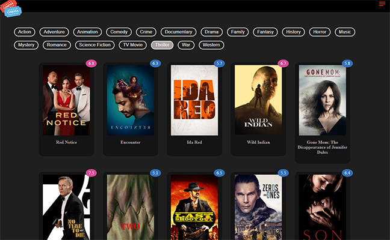
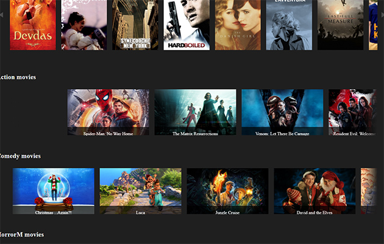
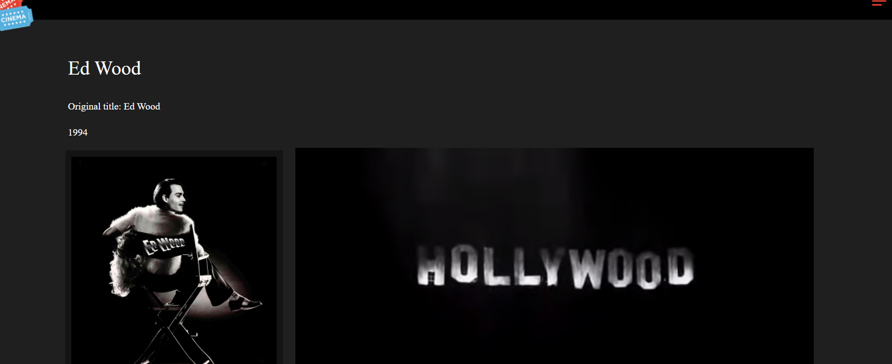

# movie_site_clone
Clone of movie site using The Movie Database (TMDB) API

### Installation

1. Clone the repo
```
git clone https://github.com/janix374/ecommerce-book-web-shop.git
```
2. Install NPM packages
```
npm install
```
3. Start project 
```
npm start
```
4. Build the app for production to the build folder
```
npm build
``` 








